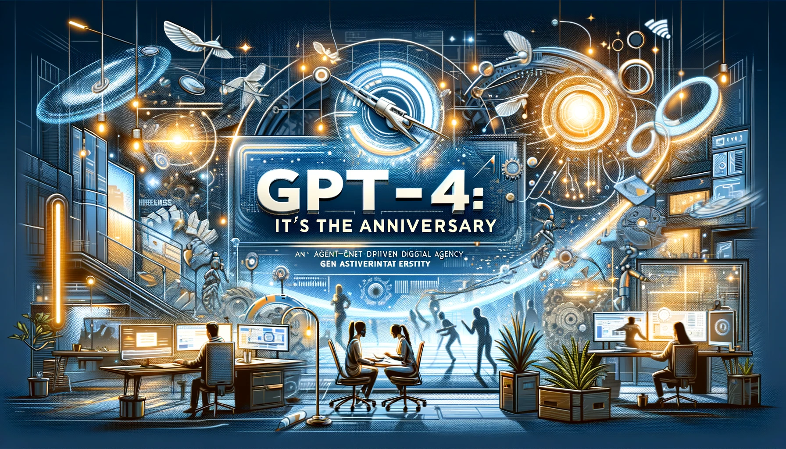

# Multi-Agent System for GPT-4 Anniversary Blog Post Creation

This project, a venture of RSM Chile Technology, Advanced Analytics, demonstrates the use of a multi-agent system to create a comprehensive and engaging blog post celebrating the anniversary of GPT-4. It leverages various agents, including researchers, writers, and critics, to produce content that is informative, well-structured, and thought-provoking.

For those interested in exploring the code behind this project or reading the detailed blog post, please follow the links below:

- **Project Code**: [main.ipynb](https://github.com/RSMChileTechnology/MultiAgentSystem_GPT4_Anniversary/blob/main/main.ipynb)
- **Blog Post**: [A Year of GPT-4: Revolutionizing Our Daily Lives](https://www.linkedin.com/pulse/celebrating-gpt-4s-first-anniversary-ai-generated-article-argomedo-fnzrf)

## Libraries and Tools Used

- **dotenv**: For loading environment variables.
- **langchain_community.utilities**: Provides utilities like `SerpAPIWrapper` for search functionalities.
- **functools, operator**: For functional programming tools.
- **langchain.agents**: Contains `AgentExecutor` and `create_openai_tools_agent` for agent execution and creation.
- **langchain_core.messages**: Includes message types like `BaseMessage`, `HumanMessage`, etc., for communication between agents.
- **langchain.output_parsers.openai_functions**: For parsing outputs from OpenAI functions.
- **langchain_core.prompts**: Provides `ChatPromptTemplate` and `MessagesPlaceholder` for dynamic prompt creation.
- **langgraph.graph**: For creating and managing state graphs.
- **langchain.tools**: General tools for the LangChain framework.
- **langchain_openai**: Integration with OpenAI's API.
- **typing**: For type annotations and type checking.

## Project Structure

- **Introduction**: Sets the context for the project and outlines the goal of creating a blog post for the GPT-4 anniversary.
- **Step 01**: Importing necessary libraries and initializing variables.
- **Step 02**: Testing objects and tools like `SerpAPIWrapper` and `ChatOpenAI`.
- **Step 03**: Creating the multi-agent system, including the setup of various agents and their roles in the content creation process.

## How It Works

The project utilizes a multi-agent system where each agent is responsible for a specific task in the content creation process. The workflow includes:

1. **Research**: Gathering relevant information and insights on GPT-4 and its impact.
2. **Writing**: Crafting the initial draft of the blog post based on the research findings.
3. **Critiquing**: Reviewing the draft and providing feedback for improvements.
4. **Revising**: Incorporating feedback to refine and enhance the blog post.

The final output is a detailed and engaging blog post that celebrates the advancements and implications of GPT-4 over the past year.

## Conclusion

This project showcases the power of collaborative AI through a multi-agent system, resulting in the creation of a high-quality blog post. It highlights the potential of combining different AI capabilities to achieve complex tasks like content creation.

## Credits

This project was made by:

- **José Gregorio Argomedo B.**, Partner, Technology at RSM Chile.
